   # Laporan Praktikum Basis Data - Pertemuan 1
   Nama: Rizal Hafiz | NIM: 25430003 | Kelas: A | Dosen: Dedi Irawan,S.Kom., M.T.I

   ## 1. Tujuan Praktikum
Pada praktikum ini, saya mempelajari cara menjalankan MariaDB menggunakan XAMPP serta mengetahui status dan port yang digunakan. Saya juga mempelajari cara mengakses MariaDB melalui CLI dan phpMyAdmin serta memahami perbedaan dari kedua cara tersebut. Selain itu, praktikum ini bertujuan agar saya dapat mengamankan akun root, membuat akun kerja dengan hak akses tertentu, membuat basis data, serta menggunakan Git dan GitHub untuk menyimpan dan mengelola hasil pekerjaan.

   ## 2. Ringkasan Dasar Teori
   Basis data merupakan kumpulan data yang saling berhubungan dan disimpan secara terorganisasi sehingga dapat digunakan dengan lebih mudah. MariaDB merupakan DBMS yang menggunakan sistem client-server, yaitu server menerima dan memproses perintah yang diberikan oleh client seperti Command Line Interface (CLI) maupun phpMyAdmin. XAMPP digunakan untuk memudahkan proses menjalankan MariaDB beserta komponen pendukung lainnya seperti Apache, PHP, dan phpMyAdmin dalam satu lingkungan kerja.
   Dalam praktikum ini, digunakan dua cara untuk mengakses MariaDB, yaitu melalui CLI dan phpMyAdmin. Penggunaan CLI perlu dipahami karena perintah yang dijalankan dapat dicatat, digunakan kembali, serta disimpan dalam repositori Git sebagai bagian dari proses pengerjaan. Dari sisi keamanan, akun root digunakan untuk keperluan pengelolaan database, sedangkan pekerjaan sehari-hari dilakukan menggunakan akun kerja dengan hak akses yang disesuaikan dengan kebutuhan.
   Git digunakan untuk mencatat perubahan pada setiap tahap pengerjaan melalui commit, kemudian hasil pekerjaan dapat dikirim dan disimpan pada GitHub. Dengan demikian, Git tidak hanya berfungsi sebagai tempat pengelolaan berkas, tetapi juga membantu mencatat perkembangan proyek dari waktu ke waktu.

   ## 3. Hasil Langkah Percobaan

   D.1 Menjalankan Layanan MariaDB

   XAMPP Control Panel berhasil dijalankan dan layanan MariaDB dapat diaktifkan melalui tombol Start pada baris MySQL. Setelah dijalankan, status layanan menunjukkan bahwa MariaDB telah aktif 
   dan menggunakan port 3306.
   
   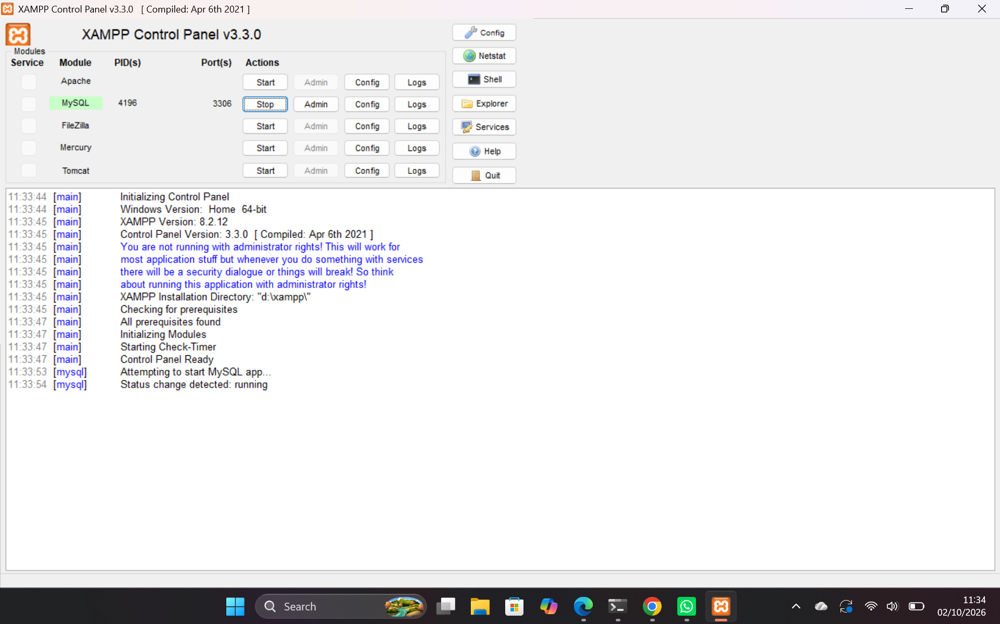

   D.2 Masuk Melalui Klien Baris Data Perintah 

   MariaDB diakses melalui Shell XAMPP/Command Prompt menggunakan akun root. Setelah berhasil masuk, dilakukan pemeriksaan versi server dan akun yang sedang digunakan menggunakan perintah:
   SELECT VERSION(), CURRENT_USER();
   Kemudian dilakukan pemeriksaan basis data dengan:
   SHOW DATABASES;

   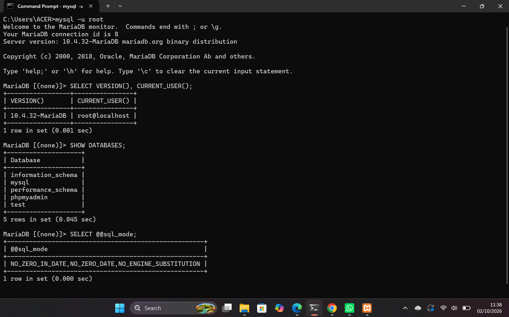

   D.3 Mengmankan Akun Root
   Akun root diamankan dengan memberikan password sehingga akses ke akun administrator tidak dapat dilakukan tanpa proses autentikasi.

   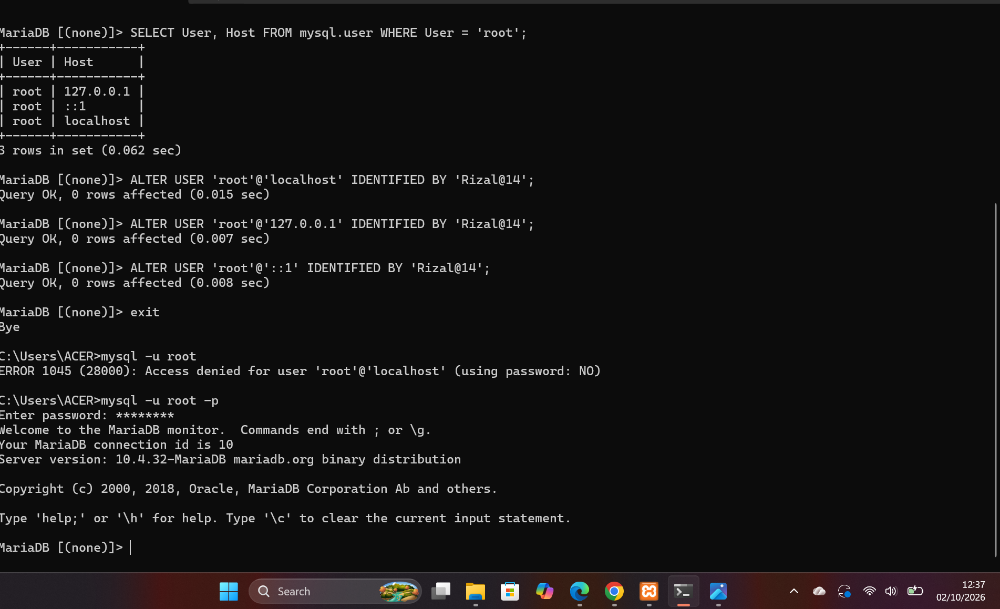

   D.4 Membuat Basis Data dan Akun Kerja
   Dibuat akun kerja mhs_003 dengan hak akses yang dibatasi pada basis data yang diperlukan. Pembatasan hak akses dilakukan agar akun kerja tidak memiliki akses yang tidak diperlukan.

   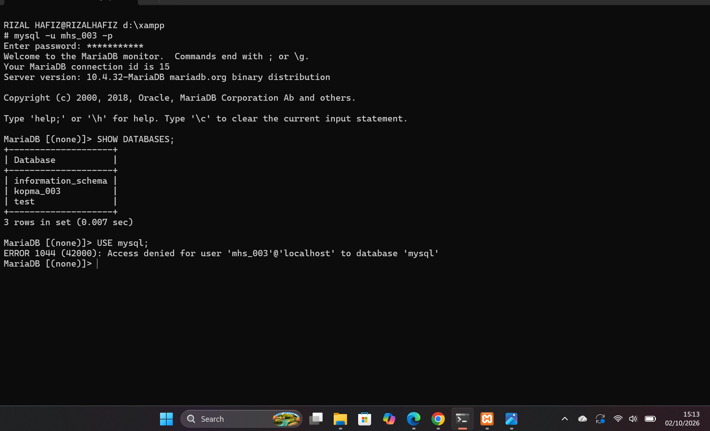

   D.5 Menggunakan PhpMyAdmin Dengan Aman
   phpMyAdmin diakses melalui browser pada alamat:
   http://localhost/phpmyadmin
   Pada praktikum digunakan metode autentikasi cookie sehingga pengguna harus melakukan login menggunakan akun MariaDB.

   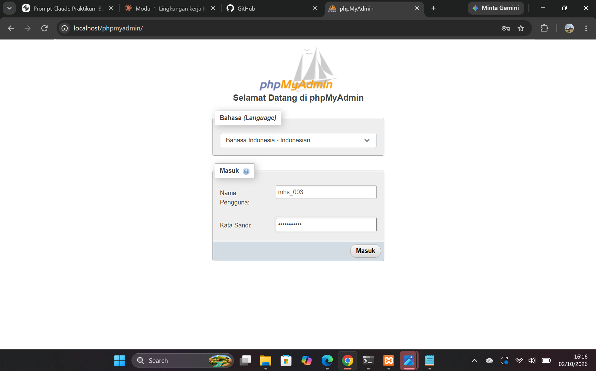
   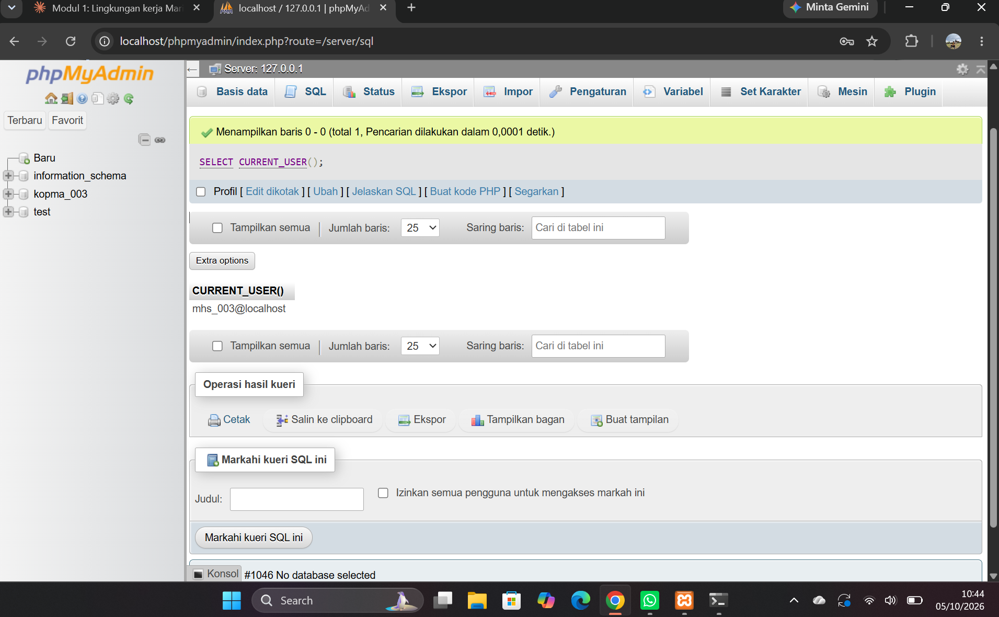

   D.6 Menyiapkan Repository Git
   Repository GitHub dibuat untuk menyimpan dan mencatat perkembangan proyek. Repository tersebut digunakan sebagai tempat penyimpanan file praktikum dan riwayat commit dari setiap pertemuan.

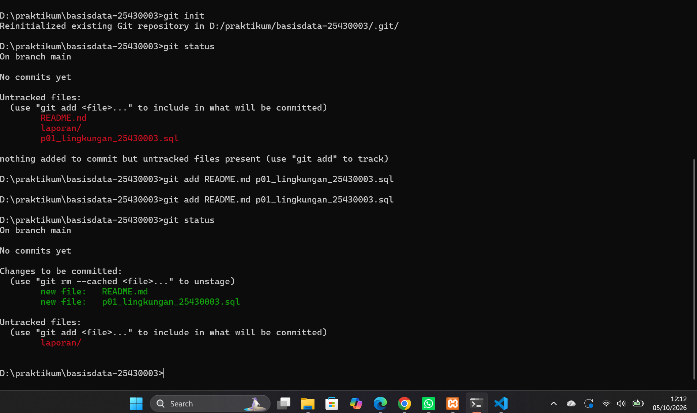
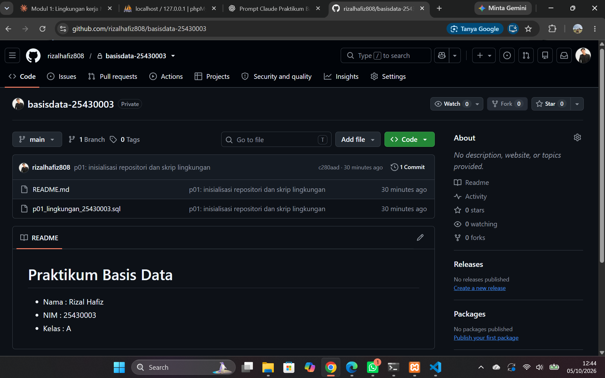

   ## 4. Jawaban Titik Analisis
   Titik Analisis 1
   Label pada XAMPP bertuliskan MySQL, tetapi server yang digunakan pada praktikum adalah MariaDB. Hal tersebut perlu diperhatikan ketika mencari solusi terhadap suatu masalah karena sintaks dan dokumentasi MySQL tidak selalu sama dengan MariaDB. Dokumentasi MySQL masih dapat digunakan untuk konsep atau sintaks yang kompatibel, tetapi untuk perbedaan fitur dan perilaku tertentu sebaiknya mengacu pada dokumentasi MariaDB.

   Titik Analisis 2
   Kode galat 1045 berkaitan dengan proses autentikasi atau login. Galat ini dapat muncul ketika username atau password tidak sesuai, termasuk ketika password tidak dikirimkan. Sementara itu, kode 1044 muncul setelah pengguna berhasil login tetapi tidak memiliki izin untuk mengakses database tertentu. Kode 1142 muncul ketika pengguna sudah berhasil login tetapi tidak memiliki hak untuk menjalankan perintah tertentu, seperti CREATE TABLE.
   Dengan demikian, perbedaannya dapat dipahami sebagai berikut:
  - 1045: gagal melakukan login/autentikasi.
  - 1044: berhasil login tetapi tidak memiliki izin mengakses database.
  - 1142: berhasil login tetapi tidak memiliki izin menjalankan perintah tertentu.

   Titik Analisis 3
   information_schema tetap terlihat karena basis data tersebut berisi informasi tentang struktur dan metadata basis data yang dapat dilihat oleh pengguna. Berbeda dengan itu, basis data mysql berisi informasi sistem yang aksesnya dibatasi, sehingga akun mhs_003 yang tidak memiliki hak akses ke database tersebut mendapatkan ERROR 1044.

   Perbedaan ERROR 1044 dan 1045 terletak pada tahap terjadinya kesalahan. ERROR 1044 terjadi ketika pengguna sudah berhasil login ke MariaDB tetapi tidak memiliki izin untuk mengakses database tertentu, sedangkan ERROR 1045 terjadi ketika proses login atau autentikasi pengguna ditolak, misalnya karena password tidak dikirim atau tidak sesuai.

   Titik Analisis 4
  Mode cookie lebih aman karena pengguna harus memasukkan password ketika melakukan login ke phpMyAdmin. Pada mode config, password disimpan di dalam berkas konfigurasi sehingga phpMyAdmin dapat melakukan login menggunakan informasi yang tersimpan di dalam berkas tersebut. Oleh karena itu, mode cookie lebih aman karena password tidak disimpan secara langsung di dalam berkas konfigurasi.

   ## 5. Hasil Latihan dan Modifikasi
   E.1 Akun tamu_003
   Dibuat akun tamu_003 dengan hak akses SELECT pada basis data yang ditentukan oleh modul. Ketika akun tersebut mencoba menjalankan perintah CREATE TABLE, muncul penolakan karena akun hanya memiliki hak untuk membaca data.
   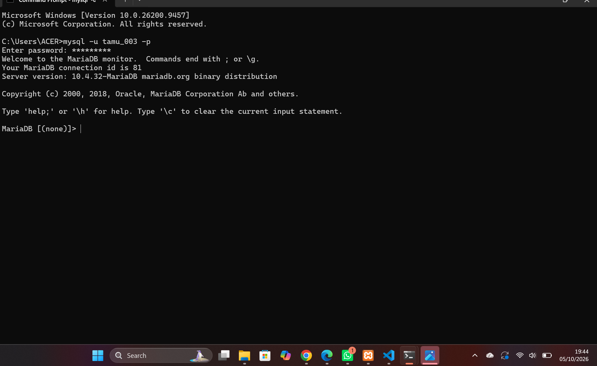

   E.2 Skrip agar Dapat Dijalankan Berulang Kali
   Skrip dimodifikasi menggunakan IF NOT EXISTS sehingga objek yang sudah ada tidak menyebabkan proses pembuatan berhenti karena error. Skrip kemudian diuji dengan menjalankannya kembali untuk memastikan proses dapat dilakukan berulang kali.

   -- p01_lingkungan_25430003.sql
-- Password sengaja diganti penanda. JANGAN commit password asli.
 CREATE DATABASE IF NOT EXISTS kopma_003
  CHARACTER SET utf8mb4 COLLATE utf8mb4_unicode_ci;
CREATE USER IF NOT EXISTS 'mhs_003'@'localhost' IDENTIFIED BY '<password_kerja>';

GRANT ALL PRIVILEGES ON kopma_003.* TO 'mhs_003'@'localhost';
   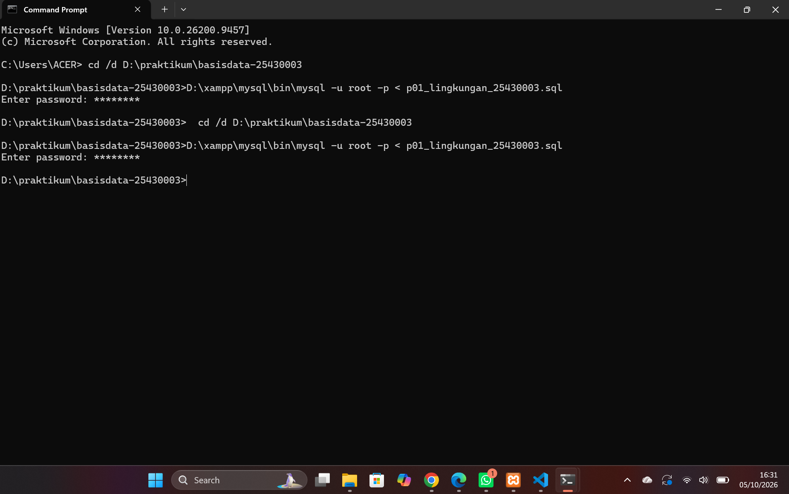

   ## 6. Tugas Mandiri: Milestone Proyek 01
   Pada pertemuan pertama, saya mulai menentukan proyek pribadi yang akan dikembangkan sampai UAS. Berdasarkan dua digit terakhir NIM 03, tema proyek saya adalah Perpustakaan.
   dentitas awal proyek saya adalah:
  - Nama: Rizal Hafiz
  - NIM: 25430003
  - Kelas: A
  - Tema: Perpustakaan
  - Kode tema: perpus
  - Tiga digit terakhir NIM: 003
  - Nama database proyek: perpus_003
  - Akun proyek: dev_003
   Database proyek dibuat menggunakan utf8mb4. Akun dev_003 hanya diberikan hak akses pada database proyek dan tidak diberikan akses ke database kopma_003.
   Saya juga membuat README yang berisi identitas proyek dan menambahkan .gitignore untuk mencegah file yang berisi kredensial ikut tersimpan di repository. Ketentuan modul memang meminta milestone pertama berupa repository, database dan akun proyek, README identitas proyek, serta .gitignore.

   Lingkup Proyek
   Proyek ini membahas pengelolaan layanan perpustakaan yang mencakup data buku, anggota, serta kegiatan peminjaman dan pengembalian buku. Sistem ini nantinya digunakan untuk membantu pencatatan data perpustakaan agar lebih teratur dan memudahkan proses pengelolaan informasi.
   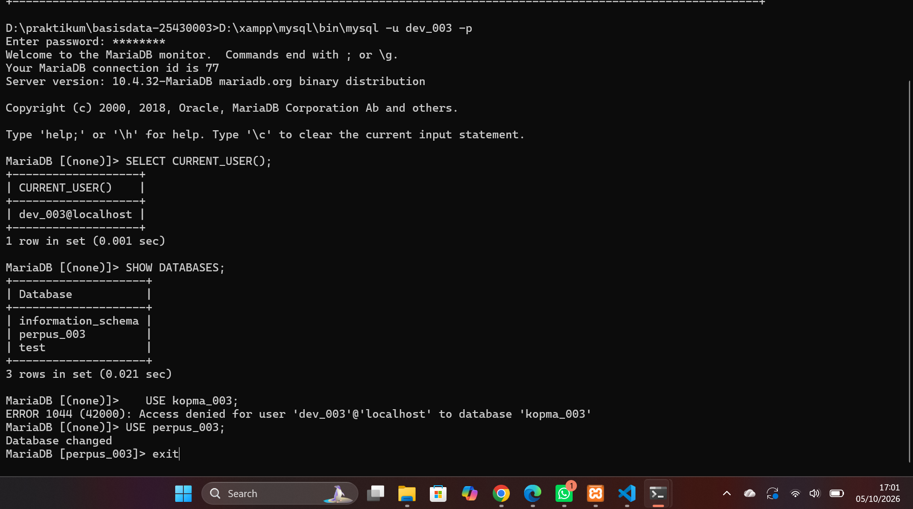
   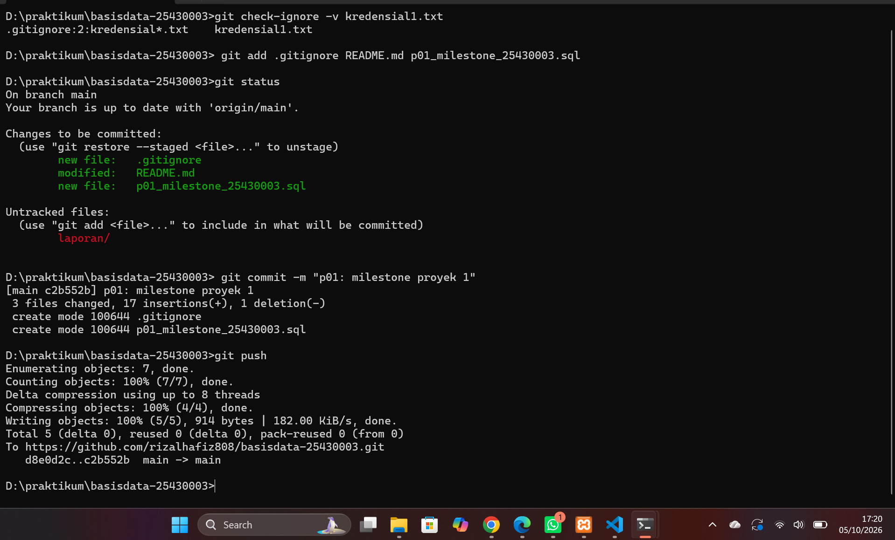

   ## 7. Pembahasan dan Kendala
   Pada praktikum pertama saya mempelajari bahwa sebelum membuat atau mengolah data, lingkungan kerja database harus disiapkan terlebih dahulu. Saya mulai memahami hubungan antara XAMPP, MariaDB, CLI, phpMyAdmin, akun pengguna, hak akses, serta Git dan GitHub.
   Salah satu bagian yang cukup penting bagi saya adalah memahami pesan error. Sebelumnya kode error mungkin terlihat seperti angka biasa, tetapi setelah mengikuti praktikum saya mengetahui bahwa setiap kode memberikan informasi tentang masalah yang terjadi. Contohnya, ERROR 1045 berkaitan dengan login, ERROR 1044 berkaitan dengan izin mengakses database, dan ERROR 1142 berkaitan dengan izin menjalankan perintah.

   ## 8. Kesimpulan
   Pada praktikum pertemuan pertama, saya telah mempelajari cara menyiapkan lingkungan kerja MariaDB menggunakan XAMPP, melakukan koneksi melalui CLI dan phpMyAdmin, serta mengatur akun dan hak akses pengguna. Saya juga memahami dasar penggunaan Git dan GitHub untuk menyimpan serta mencatat perkembangan proyek. Dari praktikum ini saya mendapatkan pemahaman awal bahwa pengelolaan basis data tidak hanya berkaitan dengan menjalankan perintah SQL, tetapi juga mencakup keamanan, hak akses, dan pencatatan proses pekerjaan.

   ## 9. Pernyataan Penggunaan AI
   
   ## 10. Bukti Git
   
   ## 11. Checklist